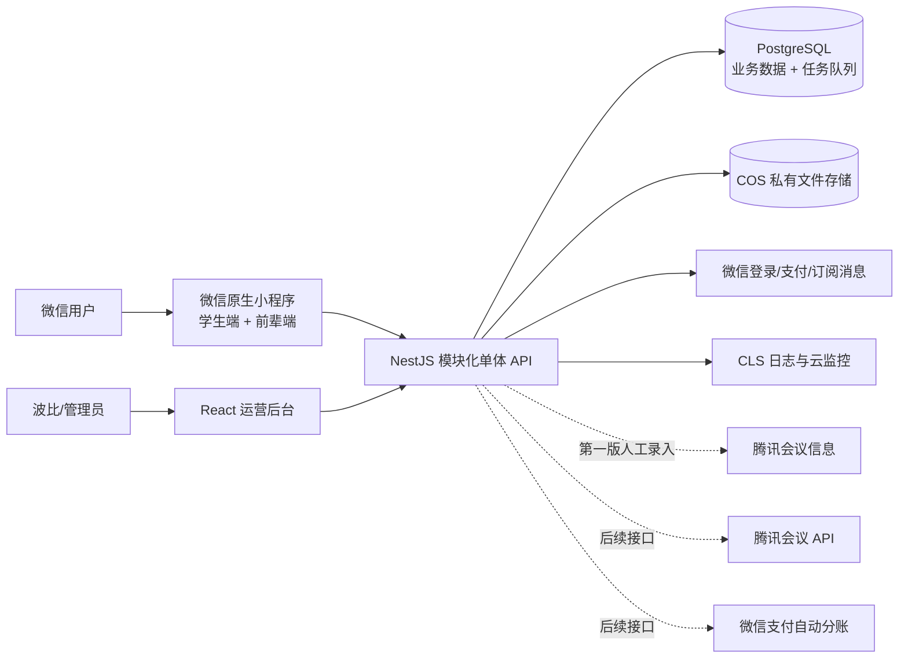

# 求职前辈咨询小程序技术栈方案

> **方案 A｜正式生产版技术栈。** 本文档保留真实小程序上线所需的完整技术选择；方案 B 演示版采用独立的无后端静态实现，见 `memory-bank/demo-design.md`，两者不共用运行时或验收口径。  
> 基于《求职前辈咨询小程序产品设计文档》V1.5
> 方案目标：第一版开发和运维尽量简单，同时保证预约、支付、退款、隐私材料和人工结算可靠。  
> 更新日期：2026-09-03

## 1. 结论

第一版推荐采用以下组合：

| 层级 | 推荐技术 | 用途 |
| --- | --- | --- |
| 学生端/前辈端 | 微信原生小程序 + TypeScript + TDesign Miniprogram | 同一个小程序内按用户身份展示不同功能 |
| 运营后台 | React 19 + Vite + Ant Design 6 + TanStack Query | 前辈、订单、会议、退款、结算和数据管理 |
| 后端 | Node.js 24 LTS + TypeScript + NestJS 11 | 统一业务接口、权限和订单状态流转 |
| 数据库 | 腾讯云 PostgreSQL 高可用版 | 用户、档期、订单、账务和审计的唯一事实来源 |
| 数据访问 | Prisma ORM 7 + SQL Migration | 常规增删改查、事务和数据库结构变更 |
| 定时任务/队列 | pg-boss | 支付超时、提醒、状态流转、文件删除和失败重试 |
| 文件存储 | 腾讯云 COS 私有桶 | 简历、Offer/学历/实习证明和结算凭证 |
| 支付退款 | 微信支付 API v3 | 小程序支付、退款、回调和对账 |
| 消息通知 | 微信订阅消息 + 小程序站内消息 | 学生、前辈和管理员提醒 |
| 紧急短信 | 腾讯云短信 | 仅在咨询前 2 小时缺少有效会议时通知波比 |
| 部署 | 腾讯云 CloudBase 云托管 + Docker | 部署后端，按访问量弹性伸缩 |
| 后台托管 | CloudBase 静态网站托管 | 发布运营后台网页 |
| 日志监控 | 腾讯云 CLS + 云监控 | 日志检索、异常告警和业务监控 |
| 密钥管理 | 腾讯云凭据管理系统 SSM | 保存支付密钥、证书和服务端密钥 |

总体形态采用“模块化单体”，不采用微服务：一套后端代码、一套 PostgreSQL、一套文件存储。它足以承接现有约 2 万小红书粉丝和多个微信群带来的短时流量，同时不会把第一版做成难以维护的分布式系统。

## 2. 总体架构



核心原则：

1. PostgreSQL 是订单、档期、金额和状态的唯一事实来源。
2. 所有金额以“分”为整数保存，禁止用浮点数计算钱。
3. 所有时间在数据库中以 UTC 保存，页面统一按 `Asia/Shanghai` 展示。
4. 只有后端能够改变订单、支付、退款和结算状态。
5. 外部回调和关键写操作必须支持重复请求而不产生重复结果。
6. 文件地址不公开，每次查看都由后端重新鉴权并签发短时链接。

## 3. 客户端技术选择

### 3.1 微信原生小程序

推荐：

- 微信原生小程序框架。
- TypeScript。
- TDesign Miniprogram 1.x 组件库。
- 小程序分包加载。
- 微信原生登录、支付、文件选择和订阅消息能力。

选择原因：

- 第一版只服务微信，不存在同时发布支付宝、抖音或 App 的确定需求。
- 原生方案与微信登录、支付、订阅消息、隐私接口的适配链路最短。
- 避免 Taro、uni-app 带来的框架适配层和排查成本。
- TDesign 是腾讯开源组件库，视觉和微信场景匹配，能够减少自制基础组件。

小程序内部仍然只有一套账号。普通用户登录后默认拥有学生能力；通过审核并绑定前辈档案后，同一账号增加前辈角色，页面中出现“前辈工作台”，无需安装或登录另一个小程序。

建议分包：

```text
主包：首页、前辈列表、前辈详情、登录态
学生分包：预约、支付、我的预约、订单详情
前辈分包：资料提交、工作台、订单资料
公共分包：协议、隐私说明、帮助与联系波比
```

### 3.2 运营后台

推荐：

- React 19。
- Vite。
- Ant Design 6。
- React Router。
- TanStack Query，负责接口数据缓存、刷新和错误重试。

第一版经营数据使用统计卡片和表格即可，不额外引入图表库；确认存在图表展示需求后再选择依赖。

不使用 Next.js：后台没有搜索引擎收录和服务端渲染需求，Vite 单页应用更直接、部署更便宜。

第一版只设置波比一个超级管理员身份。管理员登录使用独立账号、强密码和 TOTP 动态验证码，后台不开放注册。高风险操作如退款、修改金额和登记结算应再次验证身份并弹出二次确认。若后续运营人员增多，再设计多级角色或接入企业微信身份认证。

## 4. 后端技术选择

### 4.1 Node.js + NestJS 模块化单体

推荐：Node.js 24 LTS、TypeScript、NestJS 11，使用默认 Express 适配器。

第一版建议按照业务模块拆代码，但仍作为一个应用部署：

```text
Auth                微信登录、管理员登录、会话
Users               用户、角色和登录信息
SeniorProfiles      前辈档案、邀请、审核和证明材料
Search              首页基础排序、编号直达、标签解析、四维动态加权和匹配理由
Availability        周期档期、例外日期和具体时间段
Booking             占位、预约、改期和取消
Orders              订单状态机和订单资料
Payments            微信支付、退款、回调和对账
Meetings            人工录入会议、提醒、后续 API 适配
Notifications       订阅消息、站内消息、运营紧急短信和发送记录
Settlements         80%/20% 计算、人工结算和导出
Files               私有上传、查看授权和定时删除
Analytics           统一埋点、搜索和交易转化口径
Audit               敏感访问和管理操作审计
Jobs                定时任务、重试和异常待办
```

选择模块化单体而不是微服务的原因：

- 预约、支付、退款和结算之间存在大量强事务关系，共用数据库更可靠。
- 第一版团队和业务量不需要独立服务治理。
- 部署、日志、排错和本地开发都更简单。
- 微信支付等外部协议只在对应业务模块内处理，避免第三方细节扩散到订单逻辑。

第一版不为尚未接入的腾讯会议 API、自动分账、其他通知渠道或替代存储预建通用 Provider 接口。当前只实现微信支付、人工会议信息、现有通知、人工结算和 COS 所需的具体模块；出现第二种真实实现后，再从已有代码中提取必要抽象。

### 4.2 API 形式

采用 REST JSON API，并由 NestJS 生成 OpenAPI 文档。第一版不使用 GraphQL。

- 小程序和后台只调用后端 API，不直接访问数据库或 COS 私密文件。
- 每个请求携带 `request_id`，方便从页面问题追踪到日志和订单。
- DTO 使用统一校验；服务端不能信任前端传来的金额、角色和订单状态。
- 对创建订单、发起支付、退款、改期确认等写接口支持 `idempotency_key`。

## 5. 数据库与预约并发

### 5.1 PostgreSQL

推荐使用腾讯云 PostgreSQL 高可用版，生产环境开启自动备份和时间点恢复。开发、测试和生产使用不同数据库实例或至少不同数据库与账号。

选择 PostgreSQL 而不是小程序云数据库/纯 NoSQL 的原因：

- 档期连续占用、订单金额、退款和结算都需要可靠事务。
- 多条件后台筛选、财务汇总和审计记录更适合关系数据库。
- 后续群面和讲座的活动、场次、报名、候补也天然是关系模型。

Prisma ORM 负责大多数模型与查询；数据库约束、部分索引和并发锁用 SQL migration 明确定义。初期锁定 Prisma 7 的稳定小版本，不在支付型 MVP 中追逐刚发布的大版本。

### 5.2 档期与防重复预约

因为产品以 30 分钟为最小单位，推荐生成具体的 30 分钟档期，并建立占用明细表：

```text
availability_slots
- senior_id
- slot_start
- slot_end
- status

slot_reservations
- order_id
- senior_id
- slot_start
- status: HELD / CONFIRMED / RELEASED
- expires_at
```

数据库对“处于 HELD 或 CONFIRMED 状态的 `senior_id + slot_start`”建立唯一约束。30、60、90 分钟订单分别在同一事务中占用 1、2、3 个连续时间段；任何一段冲突，整笔订单都不创建。

创建订单流程：

1. 服务端再次校验档期位于未来 7 天内，并距开始至少 6 小时。
2. 在数据库事务中插入订单、材料版本和全部档期占用记录。
3. 订单进入待支付，档期占用 15 分钟。
4. 支付成功回调把占位改为正式占用。
5. 超时任务关闭未支付订单并释放全部时间段。

这样即使小红书帖子或微信群带来瞬时并发，也由数据库约束决定谁成功，不依赖前端按钮是否变灰。

### 5.3 轻量搜索实现

第一版搜索直接使用 PostgreSQL 中的结构化标签和普通查询，不引入 Elasticsearch、向量数据库或机器学习模型：

- 投稿编号规范化后按唯一编号精确查询。
- 标签词典保存标准名、维度、业务大类、别名和版本。
- 一句话搜索由后端依据词典确定性提取目标方向、求职阶段、教育背景和可辅导内容，不解析时间和时长。
- 非编号查询按目标方向 40%、经历深度 30%、教育背景 15%、可辅导内容 15%动态计算；用户未表达的维度不计入分母。
- 经历深度由最终去向、正式 Offer、暑期留用 Offer、终面、面试、通过简历和相关实习等公开结构化事实确定，不通过生成式 AI 推断。
- 匹配理由只从公开标签和经历字段生成，不读取档期、证明材料或其他私密字段。
- 首页使用方向分散和轮换曝光的基础排序；档期不参与首页或搜索排序，只由 Booking/Availability 在预约阶段校验。
- 使用固定评测数据验证排序；初期规模无需额外搜索基础设施。

## 6. 支付、退款与账务

### 6.1 微信支付 API v3

支付链路：

```text
创建待支付订单并锁档期
→ 后端按数据库价格创建微信支付单
→ 小程序调起微信支付
→ 微信支付异步回调后端
→ 后端验签、解密并幂等更新订单
→ 小程序主动查询后端订单结果
```

必须落实：

- 支付金额只在服务端根据价格快照计算。
- 回调必须验签，并使用 API v3 规则解密通知内容。
- 以微信支付单号和回调事件建立唯一约束，重复回调只返回成功，不重复记账。
- 小程序显示“支付成功”不能代替服务端支付结果；回调延迟时使用订单查询补偿。
- 退款接口、退款回调和人工重试全部幂等。
- 每日执行微信账单与本地支付流水对账，差异进入后台待办。

微信支付目前没有官方 Node.js SDK。第一版应把签名、验签、证书更新和回调解密集中在具体的 `WechatPayService` 中，按官方 API v3 协议实现，并进行固定样例和回调重放测试。若采用第三方 Node.js 库，必须锁定版本、审查维护状态和依赖，业务代码不得直接依赖该库。不要仅为支付再引入一个 Java/Go 微服务；未来交易量或合规要求明显提高时，再评估迁移到官方 Java/Go SDK。

### 6.2 账务模型

不要只在订单表中反复覆盖一个“金额”字段。建议同时保存：

- 原始订单金额。
- 改期补收流水。
- 取消/改期退款流水。
- 最终净收入。
- 前辈应结金额：最终净收入 × 80%。
- 波比收入：最终净收入 × 20%。
- 人工结算批次、实付金额、凭证和操作人。

所有支付、退款和结算流水只新增或冲正，不物理删除。管理员修正金额也必须填写原因并写入审计日志。

## 7. 定时任务和可靠通知

第一版推荐 pg-boss。它直接使用 PostgreSQL 作为任务队列，无需另外购买和维护 Redis。

适用任务：

- 15 分钟未支付订单关闭与档期释放。
- 咨询前 24 小时、2 小时提醒。
- 咨询前 2 小时仍无会议的高优先级待办。
- 到开始时间进入“咨询中”。
- 到结束时间订单进入“已完成”，并在后台独立生成待结算记录。
- 咨询结束 7 天后撤销前辈简历访问。
- 90 天后删除原始简历。
- 支付查询、退款查询、订阅消息和对账失败重试。

推荐使用“业务事务 + Outbox”模式：订单状态变更和“待发送事件”在同一个数据库事务中写入，后台任务再负责发送微信消息。即使微信接口短暂失败，订单不会回滚，通知也不会永久丢失。

后端容器第一版可以同时运行 API 和 pg-boss worker，并将最小实例数设为 1，防止无人访问时定时任务停摆。业务增长后再把同一代码中的 worker 作为独立服务部署，无需改写业务模块。

## 8. 文件与隐私安全

所有简历、学历证明、实习证明、Offer 证明和结算凭证进入 COS 私有桶，不允许公开读。

推荐流程：

1. 前端向后端申请上传。
2. 后端校验用户、订单/邀请状态、文件类型和大小。
3. 后端签发最小权限、短时有效的上传凭证。
4. 前端直传 COS，降低后端流量压力。
5. 后端记录文件 ID、所属对象、版本、哈希、类型和过期时间。
6. 查看文件时后端逐次鉴权并签发短时下载链接。

权限规则必须在后端执行：

- 前辈证明材料只有管理员可见。
- 学生简历在支付前只有学生本人和管理员可见。
- 支付成功后仅订单对应前辈可见。
- 咨询结束 7 天后，前辈访问被拒绝。
- 90 天后删除原始简历，并保存删除结果和审计记录。
- 日志中不得记录下载链接、简历正文、证件号、支付密钥和完整联系方式。

COS 生命周期规则可作为兜底，但业务删除任务仍应由系统执行并记录，因为不同文件的保留期限取决于订单状态。

## 9. 部署、环境与运维

### 9.1 腾讯云部署

推荐将服务部署在同一腾讯云地域：

- 后端：CloudBase 云托管，使用 Docker 镜像，最小实例数 1，按 CPU/请求量弹性扩容。
- 运营后台：CloudBase 静态网站托管，绑定独立后台域名并启用 HTTPS。
- 数据库：腾讯云 PostgreSQL 高可用版，仅允许后端网络访问。
- 文件：COS 私有桶。
- 日志：CLS 结构化 JSON 日志。
- 告警：云监控通知到波比和技术维护人员。
- 密钥：SSM 保存微信支付私钥、API v3 密钥、管理员 TOTP 加密密钥等。

不推荐第一版使用 Kubernetes。CloudBase 云托管已经提供容器、版本和弹性能力，Kubernetes 只会增加部署与故障排查成本。

### 9.2 环境隔离

至少设置三个环境：

```text
local       开发人员本地环境
staging     测试小程序、测试支付配置、脱敏测试数据
production  正式小程序和真实订单
```

三个环境应分别使用数据库、COS 路径/存储桶、微信配置和密钥。禁止把真实简历和证明材料复制到测试环境。

### 9.3 监控与告警

技术指标：

- API 错误率、P95 响应时间、容器重启和数据库连接数。
- 任务队列积压、失败次数和最老任务等待时间。
- COS 上传失败率和文件删除失败数。
- 紧急短信发送失败和重复发送次数。

业务告警：

- 支付回调验签失败、支付成功但订单未确认。
- 退款失败或退款状态长期不明。
- 咨询前 2 小时无会议信息。
- 自动状态流转失败。
- 结算公式异常或批次实付与应付不一致。
- 90 天到期文件未删除。

## 10. 代码仓库与工程规范

建议使用 pnpm workspace 单仓库：

```text
apps/
  miniprogram/       微信小程序
  admin/             React 运营后台
  api/               NestJS API、worker 和定时任务
packages/
  contracts/         API 类型、状态和业务枚举
  config/            通用配置校验
  eslint-config/     统一代码规范
prisma/
  schema.prisma
  migrations/
infra/
  Dockerfile
  deployment/
memory-bank/
```

工程要求：

- 依赖使用 lockfile 并锁定生产版本。
- 数据库结构只能通过 migration 变更，禁止在线手改表结构。
- 发布前自动执行类型检查、代码检查、单元测试和构建。
- 数据库 migration 在预发布验证后，由人工确认进入生产。
- 每次发布保留上一版本镜像；数据库变更只在确有回滚需要时保留短期兼容窗口，版本稳定后及时删除过渡逻辑。
- 配置启动时强校验，缺少支付密钥等关键配置时拒绝启动。

## 11. 测试策略

### 11.1 工具

- 后端单元和集成测试：Jest + 真实 PostgreSQL 测试库。
- 后台组件测试：Vitest + Testing Library。
- 后台端到端测试：Playwright。
- 小程序：微信开发者工具自动化能力配合真机回归。
- API 契约：OpenAPI 校验。

不要使用 SQLite 代替 PostgreSQL 做核心集成测试，否则唯一约束、事务锁和时间处理可能与生产不一致。

### 11.2 上线前必须通过的场景

1. 两名学生同时抢同一前辈同一档期，只能一人成功。
2. 60/90 分钟预约与其中任意 30 分钟档期冲突时，整单失败。
3. 支付回调重复 10 次仍只确认一次、只记一笔收入。
4. 用户支付完成但回调延迟时，主动查询能够修复订单。
5. 同一退款请求重复提交不会多退。
6. 学生和前辈各自第一次、第二次、第三次改期规则正确。
7. 学生取消退 90%、前辈取消退 100%，80%/20%重新计算正确。
8. 改期确认前原档期不释放，新档期不会被重复占用。
9. 前辈不能查看其他订单或过期后的学生简历。
10. 90 天后原始简历删除，重复执行删除任务不会报错。
11. 消息发送失败后能重试，且用户不会收到无意义的重复通知。
12. 人工录入、修改会议和结算均留下管理员审计记录。

## 12. 第一版明确不引入的技术

| 暂不采用 | 原因 |
| --- | --- |
| 微服务 | 业务规模不需要，增加部署、事务和排错成本 |
| Kubernetes | 第一版运维过重，云托管已经满足容器和弹性需求 |
| Redis | PostgreSQL 约束解决抢档期，pg-boss 解决任务队列；当前没有必须引入 Redis 的场景 |
| Taro/uni-app | 没有确定的多端需求，微信原生链路更短 |
| GraphQL | 页面查询关系不复杂，REST 更容易监控和联调 |
| Next.js | 运营后台不需要 SSR 或 SEO |
| 云数据库 NoSQL 作为主库 | 订单、档期、退款和结算需要强事务与关系查询 |
| 腾讯会议 API | 产品已确认第一版由后台人工录入 |
| 微信支付自动分账 | 产品已确认第一版系统算账、波比人工结算 |
| 自建聊天/音视频 | 双方通过订单和腾讯会议履约，第一版没有站内聊天需求 |
| Elasticsearch、向量数据库和机器学习排序 | 第一版采用结构化标签与确定性加权，数据规模和需求不需要复杂搜索系统 |

Redis 只在出现以下情况后再评估：热点查询已经造成数据库压力、需要高频限流、实时排行榜，或任务吞吐量明显超过 PostgreSQL 队列能力。

## 13. 群面和讲座的演进原则

第一版只实现一对一咨询，但群面和讲座已经是明确方向，因此保留以下最小兼容点：

- 全部业务继续使用稳定的统一用户 ID。
- 咨询订单保留 `business_type`，第一版固定为 `ONE_ON_ONE_CONSULTATION`。
- 业务事件保留 `business_type`，用于以后区分咨询、群面和讲座数据。
- 小程序、后台和后端保持现有模块边界，避免把支付、通知和文件逻辑写进具体页面组件。

第一版仍不预建活动、场次、报名、分组、讲师角色、未来运行分支或通用订单模型。群面或讲座正式进入开发范围后，先确认真实规则，再从可运行系统中演进。当前事件字段至少包括 `user_id`、`business_type`、`event_type`、业务对象标识和 `occurred_at`，不预置渠道码字段。

## 14. 推荐实施顺序

### 阶段一：基础骨架

- 微信登录、统一用户和双角色权限。
- 前辈导入、邀请提交、审核和发布。
- 首页基础排序、投稿编号直达、标签筛选、一句话搜索和四维动态加权排序。
- 私有文件上传与管理员权限。
- 运营后台基础列表、搜索和审计。

### 阶段二：交易闭环

- 档期生成、连续时段占用和 15 分钟锁定。
- 预约材料、订单状态机和微信支付。
- 人工会议录入、订阅消息和站内消息。
- 改期、取消、退款和 80%/20%结算。

### 阶段三：上线加固

- 并发、支付回调、退款和权限测试。
- 定时任务、对账、备份恢复和到期删除演练。
- 日志、监控、异常待办和告警。
- 首批前辈和档期导入、灰度测试、小范围真实支付。

## 15. 关键决策摘要

最终推荐不是“最少组件”，而是“最少且每个组件职责清楚”：

- 前端坚持微信原生，降低平台集成风险。
- 后端使用 NestJS 模块化单体，保持开发效率和业务边界。
- PostgreSQL 同时承担交易主库和轻量可靠任务队列，第一版不加 Redis。
- COS 私有存储加后端逐次鉴权，满足证明材料和简历的隐私要求。
- 微信支付协议集中在具体集成服务中；腾讯会议、通知和结算按第一版真实流程直接实现，不为未来接口预建通用抽象。
- 托管服务承担高可用、备份、弹性和日志，波比团队不自行维护服务器集群。

## 16. 官方资料

- [微信支付：小程序下单与调起支付](https://pay.wechatpay.cn/doc/v3/merchant/4012791856)
- [微信支付：支付通知验签与解密](https://pay.wechatpay.cn/doc/v3/merchant/4012791902)
- [微信支付 API v3 概述与官方 SDK 说明](https://pay.wechatpay.cn/doc/v3/merchant/4012081606)
- [CloudBase 云托管产品文档](https://cloud.tencent.com/document/product/876/46901)
- [CloudBase 静态网站托管](https://docs.cloudbase.net/hosting/introduce)
- [腾讯云 PostgreSQL 自动备份](https://cloud.tencent.com/document/product/409/68388)
- [腾讯云 COS 临时密钥与最小权限](https://intl.cloud.tencent.com/zh/document/product/436/14048?lang=zh)
- [腾讯云日志服务 CLS](https://cloud.tencent.com/product/cls)
- [腾讯云云监控告警](https://cloud.tencent.com/document/product/248/42449)
- [腾讯云凭据管理系统 SSM](https://intl.cloud.tencent.com/zh/products/ssm)
- [Node.js 发布与 LTS 周期](https://nodejs.org/en/about/previous-releases)
- [NestJS 11 迁移说明](https://docs.nestjs.com/migration-guide)
- [Prisma PostgreSQL 快速开始](https://www.prisma.io/docs/prisma-orm/quickstart/postgresql)
- [Prisma 事务文档](https://www.prisma.io/docs/orm/prisma-client/queries/transactions)
- [pg-boss 文档](https://pgboss.io/)
- [TDesign Miniprogram](https://github.com/Tencent/tdesign-miniprogram)
